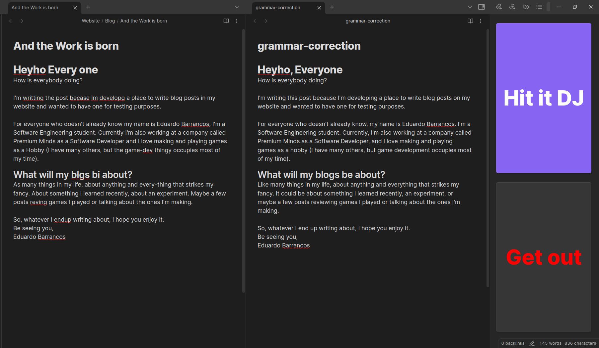

# Obsidian Papyrus

Enhance your [Obsidian](https://github.com/blacksmithgu/obsidian-dataview?tab=readme-ov-file) experience with **Papyrus** through the use of generative AI. With the press of a button dramatically improve your document's grammar or find flaw's in its structure and then correct them.

## Usage

### Setting up

[Generate an api key in OpenAI](https://platform.openai.com/api-keys). Set the field `OpenAI Key` in the settings of the plugin with the generated key.

Select the target Model and hit `Save Settings`. You're ready to go

### Available Commands

All accessible through the Obsidian's `Command Palette`

#### Analyse Project Structure

#### Review Document's Content

#### Correct Document's Grammer

`Papyrus: Correct document's grammar`

It creates a temporary file with the document's content, but with its grammar corrected, and opens it in split view with the document.

This way, the user can edit as they may without overriding the original document right away.

Finally, one may choose to override the original document or discard the new version

#### Chat with a Custom Persona

#### Import Template to Document

#### Extract Template from Document

#### Create Actionable Tasks from Docuemtn

#### Translate Document to Another Language

## Installation

How to install

Not 100% how would this work with the brainiac library
