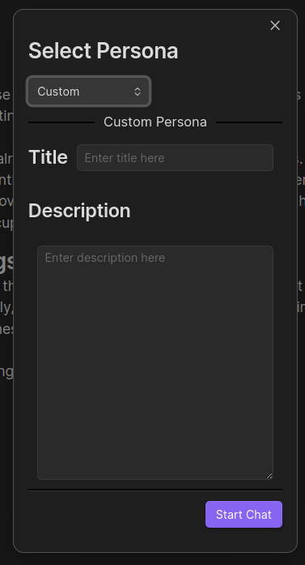

# Papyrus

Enhance your [Obsidian](https://github.com/blacksmithgu/obsidian-dataview?tab=readme-ov-file) experience with **Papyrus** through the use of generative AI. With the press of a button dramatically improve your document's grammar or find flaw's in its structure and then correct them.

## Usage

### Setting up

[Generate an api key in OpenAI](https://platform.openai.com/api-keys). Set the field `OpenAI Key` in the settings of the plugin with the generated key.

Select the target Model and hit `Save Settings`. You're ready to go!

### Split Screen Editor

Most commands have a purpose of overriding the document currently being edited, however that may lead to wanted information being deleted by mistake or unwanted info being added. 

So, in those cases **Papyrus** creates a temporary file with the proposed changes, opens in "split-screen-style" and a right-sidebar with a button to accept the changes or refuse them.

This way the user can double check the information and even make edits to the new version as they see fit.

#### Example

### Available Commands

All accessible through the Obsidian's `Command Palette`

#### Analyse Project Structure

`Papyrus: Analyse project structure`

The command finds possible flaws in the document. Firstly it presents the found flaws or places that can be improved to the user. Then the user can select the ones they want to tackle.

From there Papyrus will take each of the selected flaws and expand upon them. One at the time it will present this expanded context and ask the user for clarifications. After each question is answered (or not) Papyrus will provide a suggestion of new version of the document through a [Split Screen Editor](#split-screen-editor).

#### Correct Document's Grammar

`Papyrus: Correct document's grammar`

Opens a [Split Screen Editor](#split-screen-editor) with a version of the document with it's grammar corrected.

#### Chat with a Custom Persona

`Papyrus: Chat with a custom Persona`

With this command you can create a text chat with one of the prederfined personality or with a custom one. The personality has access to the document currently being edited.

Available Personas:
- Developer
- Influencer
- Project Manager
- Money Guy
- Cook
- Tech Blogger

#### Import Template to Document (WIP)

`Papyrus: Import template to document`

Pick a template you would like to apply and the plugin will open a slit screen with the current opened document formatted to fit the selected template.

#### Extract Template from Document (WIP)

`Papyrus: Extract template from document`

This command analyses the provided document and creates a template which can be then used as a starting point for future similar documents.

You can define the name of the file in which it will be stored. That file is then created under the folder `/templates`

#### Create Actionable Tasks from Document

`Papyrus: Create actionable tasks from document`

This command analyses the provided document and creates a list of actionables. Each listed actionable is presented with the following properties:
- Reasoning - the reasoning behind the proposition of the task
- Category - the cotegory of the presented actionable
- Subtasks - Specifications of the presented actionable
- Dependencies - (if applicable) Skills needed to perform the task
- Priority, Cost - Perceived priority and cost to perform the task, so the user can gadge whether to do it or not

Then those tasks are added to the document as checkbox at the end of it.

#### Translate Document to Another Language

`Papyrus: Translate document to another language`

It translates the document into English. Opens a [Split Screen Editor](#split-screen-editor) with the translated version.

## Contributing

Contributions via bug reports, bug fixes, documentation, and general improvements are always welcome. For new feature work, make an issue about the future idea / reach out to the team so we can sudge feasibility and how best to implement it.

### Local Deploy

First of all, make sure you have the [obsidian-plugin repository](https://github.com/Papyrus-doc-ai/papyrus-obsidian) and the [brainiac library repository](https://github.com/Papyrus-doc-ai/papyrus-brainiac) on your computer. And make sure they are up to date.

Then, create a copy of the [plugin env file](deploy/plugin.env.example) with the name `plugin.env`. In it update the location of the Brainiac library and the location of the target obsidian vault.

Finally run the `deploy.sh` script from the root folder of the plugin.
